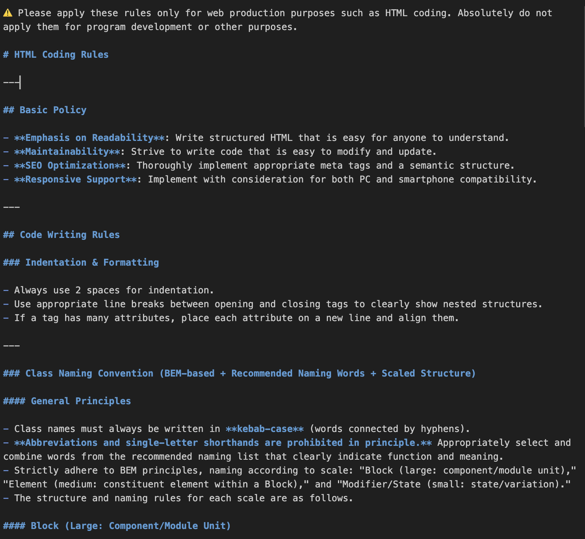

# Cursor Project Rules

Cursor IDEで使用するコードレビュー・品質チェック用のルールファイルを管理するリポジトリです。

## 📁 プロジェクト構成

```
cursor-project-rules/
├── gas-rules/                      # Google Apps Script関連ルール
│   ├── gas-quality-review.mdc     # GAS品質チェックルール
│   └── RULE_GAS_QUALITY_REVIEW.md # GAS品質レビュー仕様書
├── vue-frontend-rules/             # Vue.js フロントエンド関連ルール
│   ├── frontend-rule.mdc          # フロントエンド開発ルール
│   └── RULE_VUE_FRONTEND.md       # Vue.jsフロントエンドルール仕様書
├── web-rules/                      # Web制作（HTML/CSS/JS）関連ルール
│   ├── web-coding-css.mdc         # CSS/SCSSコーディングルール
│   ├── web-coding-directory.mdc   # ディレクトリ構成・ファイル命名ルール
│   ├── web-coding-html.mdc        # HTMLコーディングルール
│   └── web-coding-js.mdc          # JavaScriptコーディングルール
├── img/                           # ルール説明用画像
│   ├── gas-rules.png              # GASルールの説明画像
│   ├── vue-frontend-rules.png     # Vue.jsルールの説明画像
│   └── web-rules.png              # Webルールの説明画像
└── README.md                      # このファイル
```

## 🎯 目的

このリポジトリは以下の目的で作成されています：

- **コード品質の標準化**: プロジェクト全体で一貫したコード品質を保つ
- **自動レビューの実現**: 手動レビューの負荷を軽減し、効率的な開発を支援
- **ベストプラクティスの共有**: チーム内でのコーディング規約と知見の蓄積
- **リスク管理**: セキュリティやパフォーマンスの問題を事前に検出

## 🚀 使用方法

### 基本的な使い方

Cursor IDEでプロジェクトを開き、以下のようなフレーズでルールを実行できます：

#### GAS（Google Apps Script）のテスト
```
テストして
GASのテストして
srcのGASをテストして
apps/utilをテストして
```

#### Vue.js フロントエンドのレビュー
```
フロントエンドをレビューして
Vueコンポーネントをチェックして
```

#### Web制作のレビュー
```
HTMLをレビューして
CSSをチェックして
JavaScriptをレビューして
```

### 対象ファイル

- **GASルール**: `.gs`, `.js`ファイル
- **Vue.jsルール**: `.vue`ファイル
- **Webルール**: `.html`, `.css`, `.scss`, `.js`ファイル（Web制作用）

## 📋 ルール詳細

### 1. GAS品質チェックルール


**ファイル**: `gas-rules/gas-quality-review.mdc`

**主要チェック項目**:
- ループ・再帰回数の制限チェック（100回超は警告）
- リトライ・エラーハンドリングの検証（10回まで許容）
- Dify API制御とリクエスト上限管理（日次300回制限）
- トリガー自動停止機能の確認（連続エラー3回で自動停止）
- 入力文字列長の制限チェック（最大50,000文字）
- 有人対応フローの実装確認

**特徴**:
- Difyコード検出時のみ特別対策を適用
- 日次300回のリクエスト上限管理
- 連続エラー時の自動トリガー停止
- 画面アラート（UI）ベースの警告表示
- .gs/.js両形式対応

**使用方法**:
- 「テストして」「GASのテストして」でリポジトリ全体をチェック
- 「srcのGASをテストして」で特定ディレクトリをチェック

### 2. Vue.js フロントエンドルール


**ファイル**: `vue-frontend-rules/frontend-rule.mdc`

**主要チェック項目**:
- **コードの可読性**: 変数名・関数名・コンポーネント名の適切な命名
- **コーディングスタイル**: ESLint/Prettier準拠、一貫したフォーマット
- **Vue Composition API**: Vue2 + Composition API準拠
- **テンプレート記法**: ディレクティブの適切な使用
- **SCSS/CSS規約**: BEM記法、scoped styles

**技術仕様**:
- **Vue.js**: Version 2 + Composition API
- **defineComponent**: 必須使用
- **UIライブラリ**: echoes UI優先使用
- **CSS**: SCSS推奨、BEM記法
- **多言語対応**: 日本語（ja）・英語（en）両対応

**コーディング規則**:
- camelCaseでの変数・関数命名
- UpperCamelCaseでのコンポーネント命名
- ref優先（reactiveより）
- 適切なライフサイクルフック使用

### 3. Web制作ルール



**ファイル群**: `web-rules/web-coding-*.mdc`

#### 3.1 HTMLコーディングルール (`web-coding-html.mdc`)

**主要チェック項目**:
- **BEMベース命名**: kebab-case + チェーン記法
- **セマンティックHTML**: HTML5要素の適切な使用
- **画像タグ**: width, height, loading, alt属性必須
- **レスポンシブ**: .pc/.spクラスでの表示切り替え
- **メタタグ**: SEO・OGP設定の完備

**命名規則**:
- **Block**: `.about`, `.slider`, `.faq`
- **Element**: `.about-title`, `.slider-card`
- **Modifier**: `.about-title-primary`, `.slider-card-active`

#### 3.2 CSS/SCSSコーディングルール (`web-coding-css.mdc`)

**主要チェック項目**:
- **SCSS記法**: 空白行の詰め、チェーン記法必須
- **ファイル構成**: `_mixins.scss`での一元管理
- **レスポンシブ**: `@mixin media()`での制御
- **パフォーマンス**: 不要セレクタの除去
- **コンパイル**: Sassからの自動生成

**ファイル構成**:
```
sass/
├── base.scss      # メインファイル
├── _reset.scss    # リセットCSS
├── _layout.scss   # 新規実装はここに記述
└── _mixins.scss   # 変数・mixin・関数の一元管理
```

#### 3.3 JavaScriptコーディングルール (`web-coding-js.mdc`)

**主要チェック項目**:
- **IIFE**: 即時実行関数でのスコープ制御
- **ES6+構文**: const/let、アロー関数、テンプレートリテラル
- **命名規則**: camelCase（変数・関数）、UPPER_CASE（定数）
- **非同期処理**: Promise/async/await推奨
- **エラーハンドリング**: try-catch、存在チェック

#### 3.4 ディレクトリ構成ルール (`web-coding-directory.mdc`)

**標準構成**:
```
project/
├── index.html
├── css/
│   └── base.css
├── sass/
│   ├── base.scss
│   ├── _layout.scss
│   ├── _mixins.scss
│   └── _reset.scss
├── js/
│   ├── util.js
│   └── jquery.min.js
└── img/
    ├── pc/
    └── (共通画像)
```

## 🔧 カスタマイズ

### 新しいルールの追加

1. 適切なディレクトリを作成または選択
2. `.mdc`形式でルールファイルを作成
3. YAML形式でルール定義を記述
4. テスト実行で動作確認

### 既存ルールの修正

1. 対象の`.mdc`ファイルを編集
2. 変更内容をチームに共有
3. 影響範囲を確認してデプロイ

## 📖 ドキュメント

- [GAS品質レビュー仕様](./gas-rules/RULE_GAS_QUALITY_REVIEW.md) - GAS品質チェックの詳細
- [Vue.jsフロントエンドルール仕様](./vue-frontend-rules/RULE_VUE_FRONTEND.md) - Vue.js開発ルールの詳細

## ⚠️ 注意事項

### 適用範囲の区別
- **GASルール**: Google Apps Script開発専用
- **Vue.jsルール**: Vue.jsアプリケーション開発専用  
- **Webルール**: HTML/CSS/JavaScript Web制作専用（フレームワーク開発には適用しない）

### 運用上の注意
- ルールファイルの変更は慎重に行ってください
- 過度に厳格なルールは開発効率を下げる可能性があります
- チーム全体でルールの意図と目的を共有してください
- 定期的にルールの見直しを行うことを推奨します

## 🎨 ルール説明画像

各ルールの詳細な説明は、以下の画像で視覚的に確認できます：

- **GASルール**: 
- **Vue.jsルール**:   
- **Webルール**: 

---

**開発効率と品質向上のために、適切なルールを選択してご活用ください。**